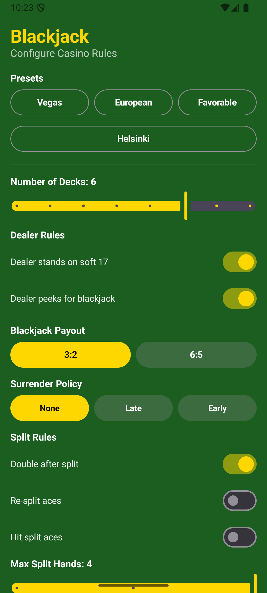
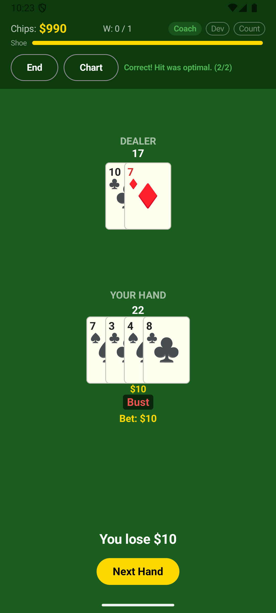

# Blackjack

An Android blackjack game built with Jetpack Compose. Play against the dealer with fully configurable casino rules, chip tracking, and a built-in coach that evaluates your plays against basic strategy.

## Features

- **Configurable rules** — deck count, dealer S17/H17, surrender policy, double after split, blackjack payout, and more
- **Rule presets** — Vegas, European, Favorable, and Helsinki Casino (with three 7s bonus)
- **Full blackjack actions** — hit, stand, double down, split, surrender, insurance
- **Coach mode** — real-time feedback on whether each decision matches optimal basic strategy
- **Animated dealing** — cards dealt one at a time with entrance animations
- **Session chip tracking** — tracks chips, wins, and hands played

## Screenshots

<p align="center">
  
  &nbsp;&nbsp;&nbsp;
  
</p>

## Getting Started

### Prerequisites

- [Android Studio](https://developer.android.com/studio) (Ladybug or newer recommended)
- JDK 17
- Android SDK with API 35 installed

### Setup

1. Clone the repository:
   ```bash
   git clone https://github.com/jmalinen/Blackjack.git
   ```

2. Open the project in Android Studio:
   - **File > Open** and select the `Blackjack` folder
   - Wait for Gradle sync to complete

3. Run the app:
   - Select a device or emulator (API 28+)
   - Click **Run** or press `Shift+F10`

### Command Line Build

```bash
./gradlew assembleDebug
```

## Tech Stack

- Kotlin 2.1.0
- Jetpack Compose (BOM 2024.12.01)
- Material 3
- Navigation Compose
- ViewModel + StateFlow (MVVM)
